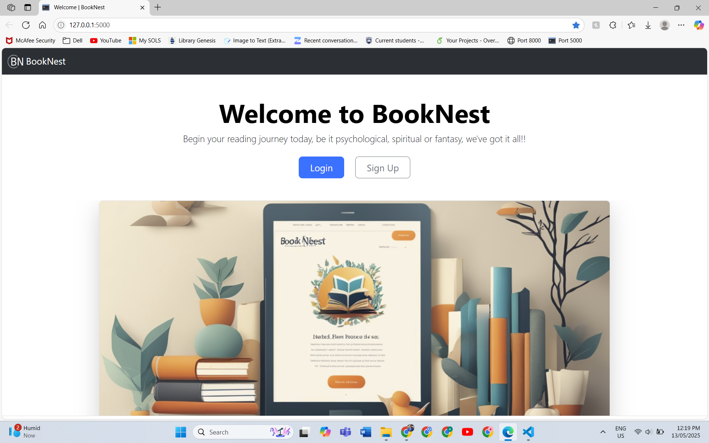
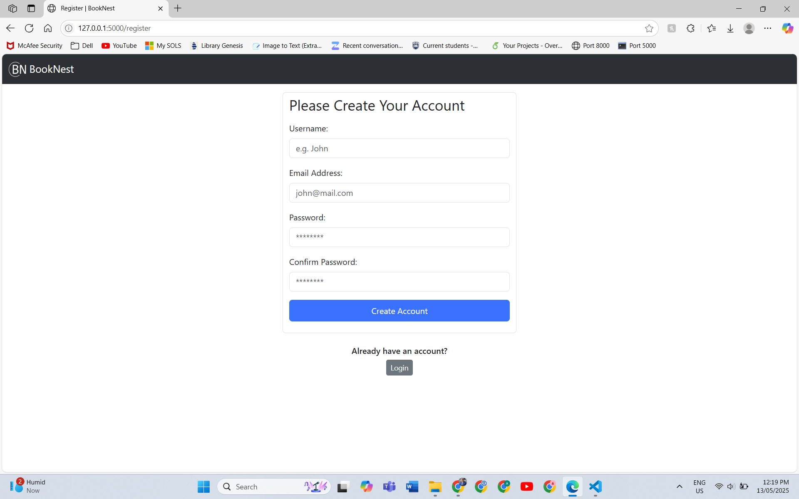
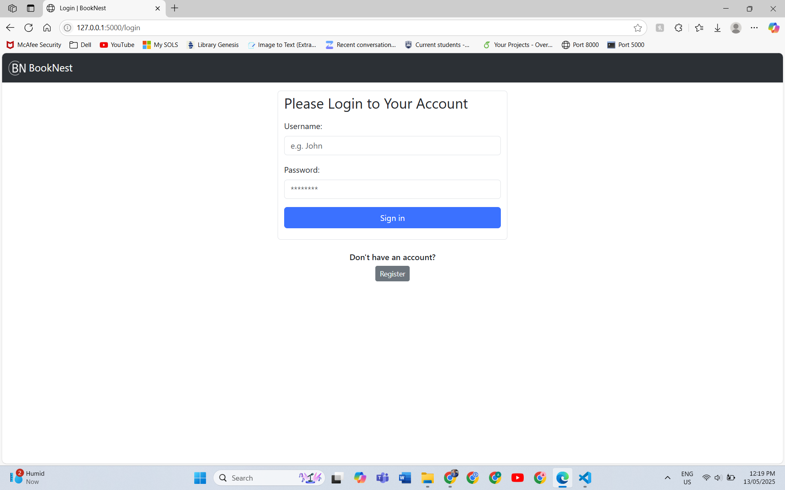
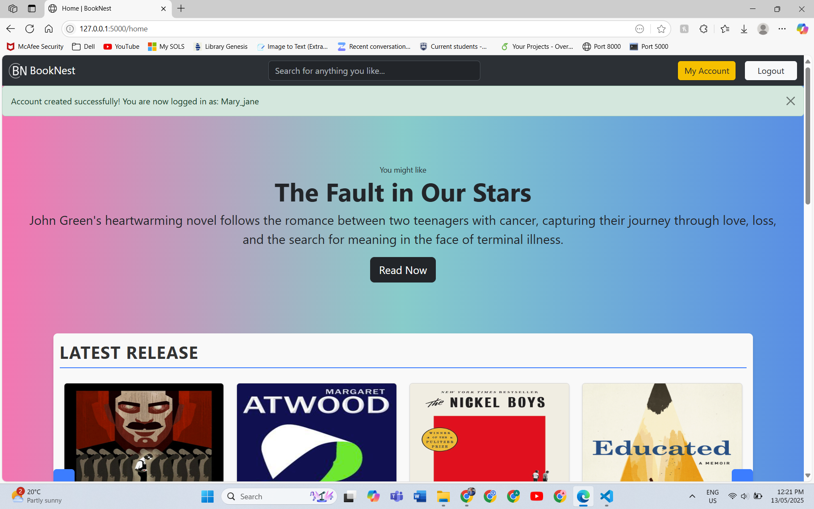
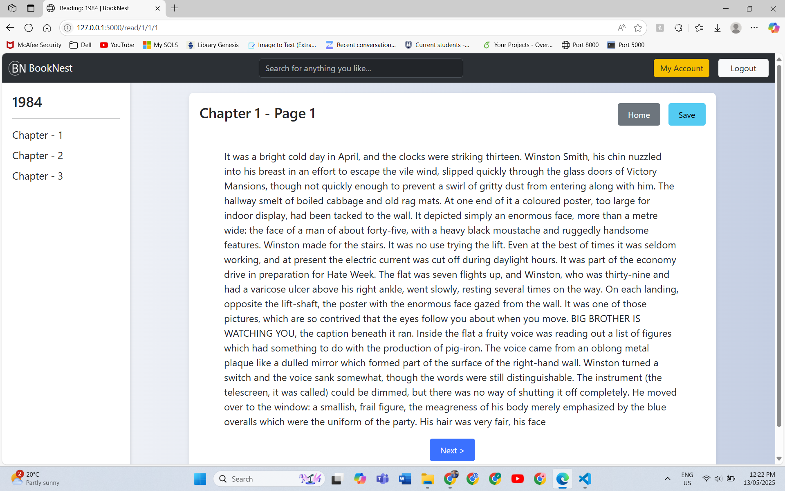
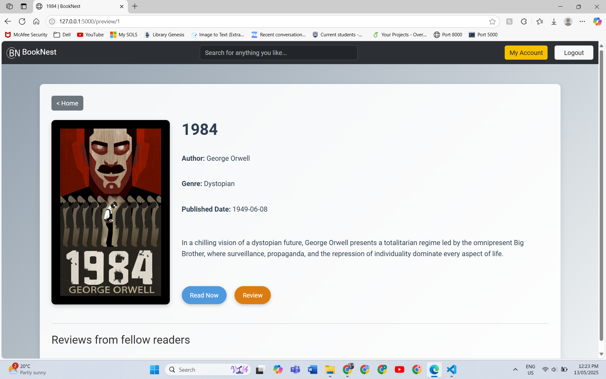
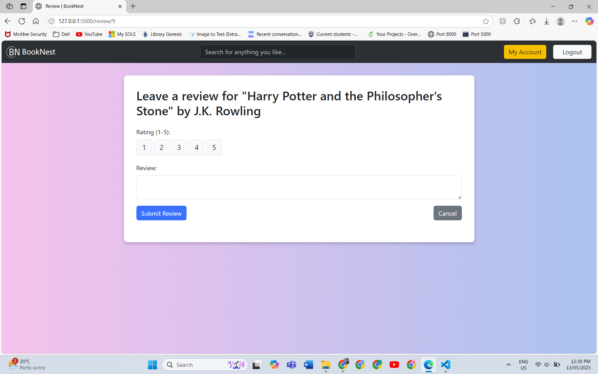
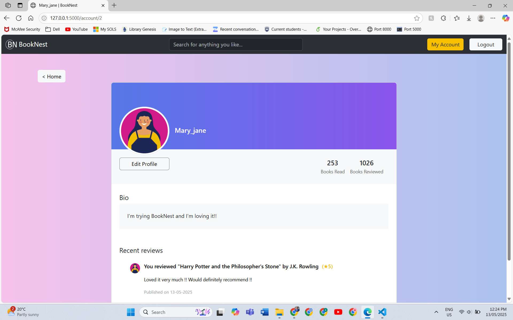
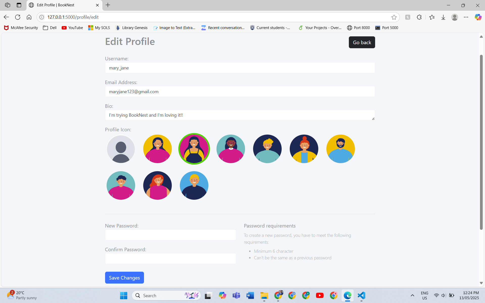

# BookNest 📚

**BookNest** is my inaugural project using the Flask framework. This web application is designed for book enthusiasts to manage their personal libraries. Users can add, view, and organize their favorite books, making it a foundational step into full-stack development with Flask.

---

## 🚀 Features

- **Book Management**: Add and view books with details like title, author, genre, and publication year.
- **User-Friendly Interface**: Simple and intuitive design for easy navigation.
- **Data Persistence**: Store book information using a SQLite database.

---

## 🛠️ Technologies Used

- **Backend**: Flask (Python)
- **Frontend**: HTML
- **Database**: SQLite
- **Version Control**: Git

---

## 📁 Project Structure

BookNest/

├── main/ # Flask application package

├── instance/ # Configuration files

├── pycache/ # Compiled Python files

├── run.py # Entry point to run the Flask app

├── seed_data.py # Script to populate the database with initial data

└── .gitignore # Git ignore file

## 📸 Screenshots

- **Landing Page**

- **Sign Up Prompt**

- **Sign In Prompt**

- **Main Page**

- **Reading Book**

- **Preview Book**

- **Review Book**

- **Your Profile**

- **Edit Profile**

---

## 📌 Installation

Follow these steps to set up and run the project locally:

### 1. Clone the Repository

git clone https://github.com/Mr-AbhiJoshi/BookNest.git

cd BookNest

### 2. Create a Virtual Environment

python -m venv env

### 3. Activate the environment

#### a. On macOS/Linux:

source env/bin/activate

#### b. On Windows:

.\env\Scripts\activate

### 4. Install Dependencies

pip install -r requirements.txt

#### Note: If requirements.txt is not present, install Flask manually:

pip install flask

### 6. Run the Application

python run.py

Access the application at: http://127.0.0.1:5000/

## 🧑‍💻 Author

Abhishek Joshi

Aspiring Software Engineer | Full-Stack Developer

📍 Wollongong, New South Wales, Australia

📧 abhijoshi1441@gmail.com